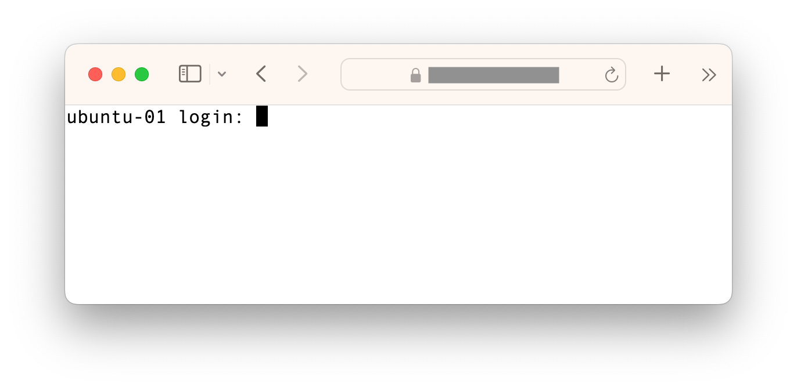
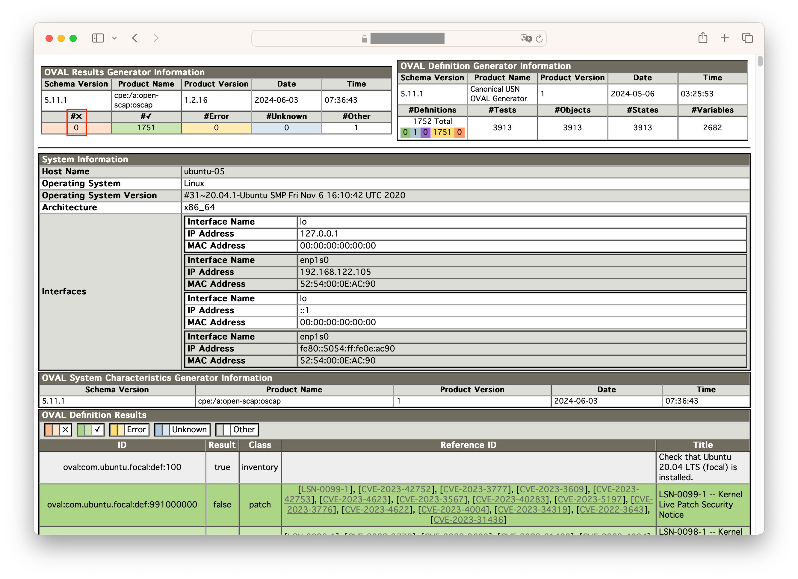

# KernelCare Playground

## I. What is this?
This is a cloud-based demo system where you can try TuxCare's KernelCare. In a managed environment that requires no installation, you can use the web console to try the basic usage of KernelCare's live patching.

## II. Prerequisites and Requirements
* Internet Browser
* HTTPS access (port: 443)
* Login credentials (provided separately)

## III. Let's get started right away
#### 1. Open the Web console
Access the API endpoint `https://<server-api-endpoint>` with your internet browser. A login prompt will appear. Log in to the system using the credentials provided.



#### 2. Check the running OS & Kernel versions
The system shall be running `Ubuntu 20.04.6 LTS`, installed from an ISO image and has not had security updates applied. Kernel version is `5.8.0-29-generic`.

```bash
$ sudo lsb_release -a
No LSB modules are available.
Distributor ID: Ubuntu
Description:    Ubuntu 20.04.6 LTS
Release:        20.04
Codename:       focal
$ uname -r
5.8.0-29-generic
```

#### 3. Register the system with a patch server
The system is pre-configured to connect to a managed patch server. Just execute the command below for registration.

```bash
$ sudo kcarectl --register ubuntu-staging
Server Registered
```

#### 4. Apply the latest patch to the in-memory Kernel
```bash
$ sudo kcarectl --update
Updates already downloaded
Patch level 11 applied. Effective kernel version 5.8.0-63.7120.04.1
Kernel is safe
```

#### 5. Make sure the effective Kernel is updated without rebooting
```bash
$ uname -r
5.8.0-63.7120.04.1
```

#### 6. (optional) Explore the details of the CVE fixes applied to the running Kernel
```bash
$ sudo kcarectl --patch-info | grep kpatch-cve: | less
kpatch-cve: CVE-2020-25705
...
```

#### 7. (optional) Revert the applied patch
```bash
$ sudo kcarectl --unload
KernelCare protection disabled. Your kernel might not be safe
$ uname -r
5.8.0-29-generic
```

## IV. Practical use case with a vulnerability scanner
In this section, we will verify that KernelCare's live patch can address vulnerabilities and pass the diagnostics of OpenScap, an open-source vulnerability scanner, without needing to reboot the system.

#### 1. Unload the patch first as initialization
```bash
$ sudo kcarectl --unload
KernelCare protection disabled. Your kernel might not be safe
```

#### 2. Count the number of existing vulnerabilities in the system
Initially, 23 unresolved vulnerabilities are found. This is because the system has not applied security updates for Ubuntu 20.04.06. Note that the scanning may take about 30 seconds to complete.

```bash
$ oscap oval eval --report report.html com.ubuntu.$(lsb_release -cs).usn.oval.xml | grep -v oval:com.ubuntu.focal:def:100 | grep true | wc -l
23
```

#### 3. Install updates from the apt repository
```bash
$ sudo apt-get upgrade -qq -y
```

```bash
$ sudo apt-get install -qq -y linux-image-5.8.0-63-generic
```

#### 4. Run the scanner again
Now you should have installed all available security updates. Despite that there are still 15 remaining vulnerabilities.
```bash
$ oscap oval eval --report report.html com.ubuntu.$(lsb_release -cs).usn.oval.xml | grep -v oval:com.ubuntu.focal:def:100 | grep true | wc -l
15
```

#### 5. Inspect the scanner report
Access `https://<server-api-endpoint>/<vm-id>/report.html`


Remaining issues were reported against Kernel, because the system is still running with the old kernel `5.8.0-29-generic` although a new kernel package has been installed to the filesystem. Normally, you have to reboot the system to activate the new kernel. However, in certain systems, this can cause downtime, which may be problematic.

#### 6. Apply the patch to the In-memory Kernel without rebooting
Make sure the `uname -r` command reports the effective running kernel with a security updated version.
```bash
$ uname -r
5.8.0-29-generic

$ sudo kcarectl --update
Updates already downloaded
Patch level 11 applied. Effective kernel version 5.8.0-63.7120.04.1
Kernel is safe

$ uname -r
5.8.0-63.7120.04.1
```

#### 7. Run the scanner again
You will find that all vulnerabilities have been addressed without rebooting the system.
```bash
$ oscap oval eval --report report.html com.ubuntu.$(lsb_release -cs).usn.oval.xml | grep -v oval:com.ubuntu.focal:def:100 | grep true | wc -l
0
```

#### 8. Inspect the scanner report
Reload `https://<server-api-endpoint>/<vm-id>/report.html`


The column `#x` indicates the number of found vulnerabilities. As you can see, all vulnerabilities have been addressed and the remaining is zero.

## V. Protection of Hidden Insecure Application Processes

Having installed all latest packages and applied kernel live patches, the scanner shows all green now. However, are you aware that there are still unprotected application processes existing?

There are services keep running with unpatched libraries even if you installed security patches. In order to make security patches effective, it is highly recommended to restart those services. You can use `checkrestart` or `needs-restarting` command to know which services require restarting.

```bash
$ sudo checkrestart | grep -E "^(systemctl|service)"
systemctl restart networkd-dispatcher.service
systemctl restart polkit.service
systemctl restart udisks2.service
systemctl restart clean-mount-point@.service
systemctl restart ModemManager.service
systemctl restart packagekit.service
systemctl restart packagekit-offline-update.service
service cron restart
service irqbalance restart
service atd restart
service shellinabox restart
service unattended-upgrades restart
service ssh restart
```
**Caution:** `checkrestart` is not available in the hands-on VM

However, what if you have important services which you never want to restart? For example, Systemd and D-Bus are typical ones, since they have many dependencies, restarting them will cause significant impact on the running system. Normally, your only option would be to reboot the entire system.

TuxCare's unique LibCare can apply patches for OpenSSL and glibc in-memory to such application processes without requiring a restart.


#### 1. Make sure you have installed all updates from the repo
```bash
$ sudo apt-get upgrade
```

#### 2. Apply the available patches to userspace processes which require protection
```bash
$ sudo kcarectl --lib-update
```

#### 3. Check which processes were applied patches in-memory
```bash
$ sudo kcarectl --lib-info | jq | grep comm
      "comm": "",
      "comm": "cron",
      "comm": "dbus-daemon",
      "comm": "irqbalance",
      ...
```

#### 4. Check the details of the fixed CVEs in-memory
```bash
$ sudo kcarectl --lib-patch-info | jq | grep \"cve\"
          "cve": "CVE-2022-4450",
          ...
```

This allows the system to become more robust, and all paching works up to this point have been achieved without the need to reboot the system.

## VI. Advanced demonstration using exploits
Live Patching not only serves as a countermeasure against vulnerability scanners, but also actually prevents exploits, as it can be demonstrated by running the POC code of the CVE-2022-0847 as known as DirtyPipe. Note that this demonstration is not available in the managed system but it can be requested separately.

* CVE-2022-0847 DirtyPipe Exploit (https://github.com/febinrev/dirtypipez-exploit)  
  Credit: Max Kellermann and Febin Mon Saji

#### 1. Make sure the `guest` user doesn't have root privileges
```bash
$ whoami
guest
$ id
uid=1001(guest) gid=1001(guest) groups=1001(guest)
$ su
Password: 
su: Authentication failure
```

#### 2. Unload kernel patches
```bash
$ sudo kcarectl --unload
KernelCare protection disabled. Your kernel might not be safe
$ uname -r
5.8.0-29-generic
```

#### 3. Run the exploit code
The attack succeeds and root privileges are taken.
```bash
$ dirtypipez 
[+] hijacking suid binary..
[+] dropping suid shell..
[+] restoring suid binary..
[+] popping root shell.. (dont forget to clean up /tmp/sh ;))
# 
```

#### 4. Confirm you are running as rootv now
```bash
# whoami
root
# id
uid=0(root) gid=0(root) groups=0(root),1001(guest)
```

#### 5. Clean up and exit from the root shell
```bash
# rm /tmp/sh
# exit
$
```

#### 6. Apply kernel patches
```bash
$ sudo kcarectl --update
Downloading updates
Patch level 11 applied. Effective kernel version 5.8.0-63.7120.04.1
Kernel is safe
$ uname -r
5.8.0-63.7120.04.1
```

#### 7. Check the CVE-2022-0847 is included in the kernel patches
```bash
$ sudo kcarectl --patch-info | grep " CVE-2022-0847"
kpatch-cve: CVE-2022-0847
```

#### 8. Make sure the exploit fails
This time kernel shall block the attack to escalate privileges.
```bash
$ dirtypipez
[+] hijacking suid binary..
[+] dropping suid shell..
usage: sudo -h | -K | -k | -V
usage: sudo -v [-AknS] [-g group] [-h host] [-p prompt] [-u user]
usage: sudo -l [-AknS] [-g group] [-h host] [-p prompt] [-U user] [-u user] [command]
usage: sudo [-AbEHknPS] [-r role] [-t type] [-C num] [-g group] [-h host] [-p prompt] [-T timeout] [-u user] [VAR=value] [-i|-s] [<command>]
usage: sudo -e [-AknS] [-r role] [-t type] [-C num] [-g group] [-h host] [-p prompt] [-T timeout] [-u user] file ...
[+] restoring suid binary..
[+] popping root shell.. (dont forget to clean up /tmp/sh ;))
sh: 1: /tmp/sh: not found
$
```
## VII. Libcare Test with a real exploit
Demonstrate Libcare can protect running application processs from known CVEs by applying patches in memory. Use CVE-2023-4813 as an example.

* https://nvd.nist.gov/vuln/detail/CVE-2023-4813 (getaddrinfo)  
  Test Code: https://github.com/tnishiox/cve-2023-4813

#### 1. Reboot the VM to rollback to the initial state
Reboot the system if you have installed the latest 'libc6' package to reproduce the vulnerability of CVE-2023-4813.
```bash
$ sudo reboot -f
```

#### 2. Register with the patch server again
```bash
$ sudo kcarectl --register ubuntu-staging
Server Registered
```

#### 3. Run exploit to see the impact of the vulnerability

The test code 'cve-2023-4813' will cause a segfault if the system is vulnerable.

```bash
$ cve-2023-4813 example.org                       
Segmentation fault (core dumped)
```

Any applications calling 'getaddrinfo' can cause a crash if you have a certain configuration in '/etc/nsswitch.conf'. For example even 'ping' command can crash.

```bash
$ cat /etc/nsswitch.conf | grep host
hosts:          dns [SUCCESS=continue] files
```

#### 4. Run exploit again
This time add delay at startup by giving the 2nd argmnent, and also run the program in background.

```bash
$ cve-2023-4813 example.org 30 &
[1] 6023
$ Wait for 30 seconds.
Run 'sudo kcarectl --lib-update' in the meantime.
```

#### 5. Quickly patch glibc in memory before the application wakes up
By doing that 'glibc' loaded by 'cve-2023-4813' process can be fixed in memory.

```bash
$ sudo kcarectl --lib-update
The patches have been successfully applied to 33 newly discovered processes. The overall amount of applied patches is 49.
Object `libc-2.31.so` is patched for 33 processes.
Object `libcrypto.so.1.1` is patched for 16 processes.
Userspace patches are applied.
```

#### 6. Wait until the application wakes up and show result
You should be able to confirm the application avoids crash and exit without problem this time.

```bash
$ getaddrinfo: Name or service not known

[1]+  Exit 2                  cve-2023-4813 example.org 30
```
Note that 'Name or service not known' error is expected result in this case.

## VIII. How to reset?
Rebooting lets the system discard all changes and reset to its initial state.
```bash
$ sudo reboot -f
```

## IX. Limitations
- Available Shell Commands

    Users are restricted to a limited bash shell and can only execute permitted commands.
    ```bash
    $ ls bin | grep -v .sh
    apt
    apt-get
    cat
    checkrestart
    cve-2023-4813
    grep
    id
    jq
    kcarectl
    kcare-scanner-interface
    less
    ls
    lsb_release
    oscap
    realpath
    reboot
    sudo
    uname
    w3m
    wc
    whoami
    ```

- Users can access only the home directory.
- Sudo can be executed with only permitted commands.
- Only one user can login at a time.
- None of the file transfer protocols (scp, sftp, rsync) is permitted.
- System will automatically reset if a user remains logged in for an extended period.
- Target system regularly reboots to reset to its initial state regardless of the login state.
