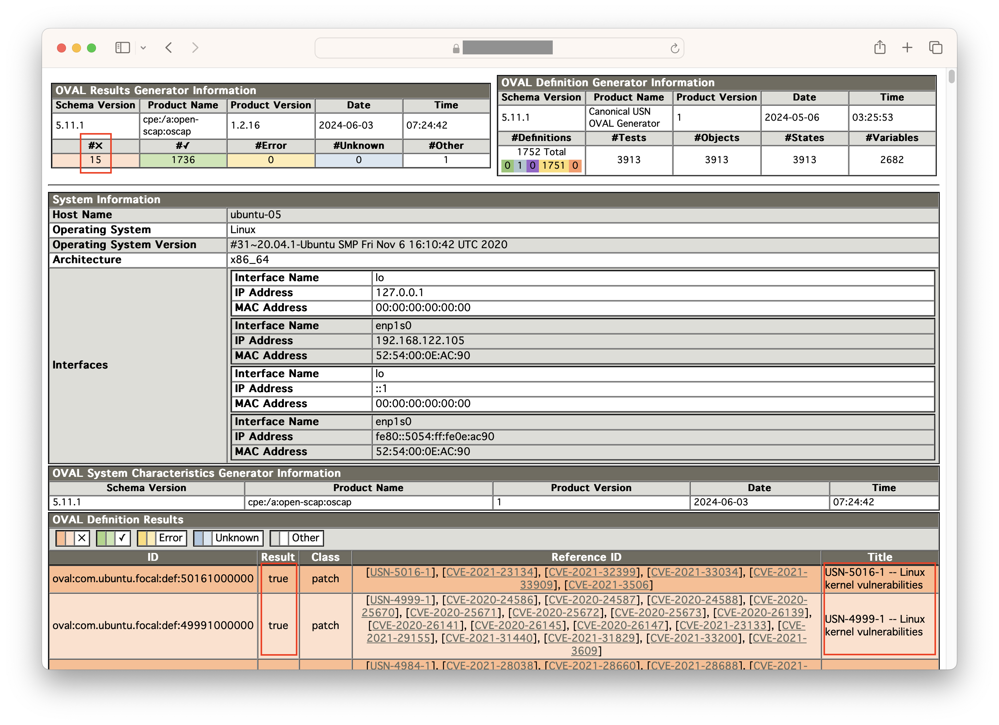

# KernelCare Playground

## What is this?
This is a cloud-based demo system where you can try TuxCare's KernelCare. In a managed environment that requires no installation, you can use the web console to try the basic usage of KernelCare's live patching.

## Prerequisites and Requirements
* Internet Browser
* HTTPS access (port: 443)
* Login credentials (provided separately)

## Let's get started right away
#### 1. Open the Web console
Access the API endpoint `https://<server-api-endpoint>` with your internet browser. A login prompt will appear. Log in to the system using the credentials provided.


#### 2. Check the running OS & Kernel versions
The system shall be running `Ubuntu 20.04.5 LTS`, installed from an ISO image and has not had security updates applied. Kernel version is `5.4.0-125-generic`.

```bash
$ sudo lsb_release -a
No LSB modules are available.
Distributor ID:	Ubuntu
Description:	Ubuntu 20.04.5 LTS
Release:	20.04
Codename:	focal
$ uname -r
5.4.0-125-generic
```

#### 3. Register the system with a patch server
The system is pre-configured to connect to a managed patch server. Just execute the command below for registration.

```bash
$ sudo kcarectl --register ubuntu-staging
Server Registered
```

#### 4. Apply the latest patch to the in-memory Kernel
```bash
$ sudo kcarectl --update
Updates already downloaded
Patch level 40 applied. Effective kernel version 5.4.0-177.197
Kernel is safe
```

#### 5. Make sure the effective Kernel is updated without rebooting
```bash
$ uname -r
5.4.0-177.197
```

#### 6. (optional) Explore the details of the CVE fixes applied to the running Kernel
```bash
$ sudo kcarectl --patch-info | grep kpatch-cve: | less
kpatch-cve: CVE-2022-33655
...
```

#### 7. (optional) Revert the applied patch
```bash
$ sudo kcarectl --unload
KernelCare protection disabled. Your kernel might not be safe
$ uname -r
5.4.0-125-generic
```

## Advanced use case with a vulnerability scanner
In this section, we will verify that KernelCare's live patch can address vulnerabilities and pass the diagnostics of OpenScap, an open-source vulnerability scanner, without needing to reboot the system.

#### 1. Unload the patch first as initialization
```bash
$ sudo kcarectl --unload
KernelCare protection disabled. Your kernel might not be safe
```

#### 2. Count the number of existing vulnerabilities in the system
Initially, 181 unresolved vulnerabilities are found. This is because the system has not applied security updates for Ubuntu 20.04.05. Note that the scanning may take about 30 seconds to complete.

```bash
$ oscap oval eval --report report.html com.ubuntu.$(lsb_release -cs).usn.oval.xml | \
    grep -v oval:com.ubuntu.focal:def:100 | grep true | wc -l
181
```

#### 3. Install updates from the apt repository
```bash
$ sudo apt-get upgrade -qq -y
```

```bash
$ sudo apt-get install -qq -y fwupd libfwupd2 libfwupdplugin5 linux-generic linux-headers-generic \
    linux-image-generic python3-update-manager ubuntu-advantage-tools update-manager-core
```

#### 4. Run the scanner again
Now you should have installed all available security updates. Despite that there are still 33 remaining vulnerabilities.
```bash
$ oscap oval eval --report report.html com.ubuntu.$(lsb_release -cs).usn.oval.xml | \
    grep -v oval:com.ubuntu.focal:def:100 | grep true | wc -l
33
```

#### 5. Inspect the scanner report
```bash
$ w3m report.html
```


Remaining issues were reported against Kernel, because the system is still running with the default kernel `5.4.0-125-generic` although a new kernel package has been installed to the filesystem. Normally, you have to reboot the system to activate the new kernel. However, in certain systems, this can cause downtime, which may be problematic.

#### 6. Apply the patch to the In-memory Kernel without rebooting
Make sure the `uname -r` command reports the effective running kernel with a security updated version.
```bash
$ uname -r
5.4.0-125-generic

$ sudo kcarectl --update
Updates already downloaded
Patch level 40 applied. Effective kernel version 5.4.0-177.197
Kernel is safe

$ uname -r
5.4.0-177.197
```

#### 7. Run the scanner again
You will find that all vulnerabilities have been addressed without rebooting the system.
```bash
$ oscap oval eval --report report.html com.ubuntu.$(lsb_release -cs).usn.oval.xml | \
    grep -v oval:com.ubuntu.focal:def:100 | grep true | wc -l
0
```

#### 8. Inspect the scanner report
```bash
$ w3m report.html
```


The column `#x` indicates the number of found vulnerabilities. Indeed all vulnerabilities have been addressed and the remaining is zero.

## Protection of Hidden Insecure Application Processes

Having installed all latest packages and applied kernel live patches, the scanner shows all green now. However, are you aware that there are still unprotected application processes existing?

There are services keep running with unpatched libraries even if you installed security patches. In order to make security patches effective, it is highly recommended to restart those services. You can use `checkrestart` or `needs-restarting` command to know which services require restarting.

```bash
sudo checkrestart | grep -E "^(systemctl|service)"
systemctl restart networkd-dispatcher.service
systemctl restart polkit.service
systemctl restart udisks2.service
systemctl restart clean-mount-point@.service
systemctl restart ModemManager.service
systemctl restart packagekit.service
systemctl restart packagekit-offline-update.service
service cron restart
service irqbalance restart
service atd restart
service shellinabox restart
service unattended-upgrades restart
service ssh restart
```
**Caution:** `checkrestart` is not available in the hands-on VM

However, what if you have important services which you never want to restart? For example, Systemd and D-Bus are typical ones, since they have many dependencies, restarting them will cause significant impact on the running system. Normally, your only option would be to reboot the entire system.

TuxCare's unique LibCare can apply patches for OpenSSL and glibc in-memory to such application processes without requiring a restart.


#### 1. Make sure you have installed all updates from the repo
```bash
sudo apt-get upgrade
```

#### 2. Apply the available patches to userspace processes which require protection
```bash
sudo kcarectl --lib-update
```

#### 3. Check which processes were applied patches in-memory
```bash
sudo kcarectl --lib-info | jq | grep comm
      "comm": "",
      "comm": "cron",
      "comm": "dbus-daemon",
      "comm": "irqbalance",
      ...
```

#### 4. Check the details of the fixed CVEs in-memory
```bash
sudo kcarectl --lib-patch-info | jq | grep \"cve\"
          "cve": "CVE-2022-4450",
          ...
```

This allows the system to become more robust, and all paching works up to this point have been achieved without the need to reboot the system.

## How to reset?
Rebooting lets the system discard all changes and reset to its initial state.
```bash
$ sudo reboot -f
```

## Limitations
- Available Shell Commands

    Users are restricted to a limited bash shell and can only execute permitted commands.
    ```bash
    $ ls bin | grep -v .sh
    apt
    apt-get
    cat
    grep
    jq
    kcarectl
    kcare-scanner-interface
    less
    ls
    lsb_release
    oscap
    realpath
    reboot
    sudo
    uname
    w3m
    wc
    ```

- Users can access only the home directory.
- Sudo can be executed with only permitted commands.
- Only one user can login at a time.
- None of the file transfer protocols (scp, sftp, rsync) is permitted.
- System will automatically reset if a user remains logged in for an extended period.
- Target system regularly reboots to reset to its initial state regardless of the login state.
